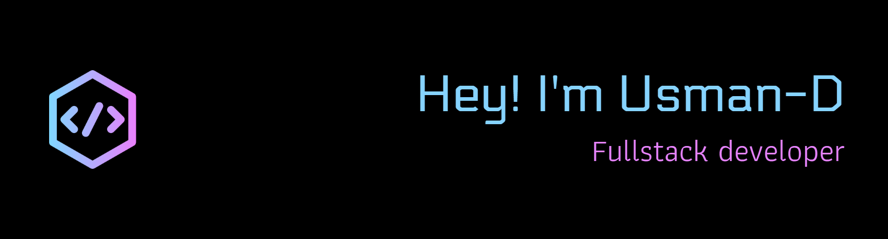

<h4 style="color:white;">About Me</h4>  
Fullstack Developer specializing in **Next.js** with strong skills in both frontend and backend development.  
Passionate about creating modern, responsive, and high-performance web applications.  
Experienced in **React**, **TypeScript**, **Tailwind CSS**, **Firebase**, and cloud-based solutions.

<h5 style="color:white;">I'm Currently </h5>

- 🚀 Building fullstack projects with Next.js and Firebase

- 📚 Expanding my knowledge in cloud architecture and scalable backend systems
- 🤝 Open to collaboration on innovative and impactful web projects
- 🛠 Continuously improving my skills in UI/UX and web performance optimization
<h4 style="color:white;">Socials </h4>

  

###

<h4 style="color:white;">Tech Stack </h4>

  
  
  
  
  
  
  
  
  
  
  
  
  

###

Want to Play Game ?

<picture style="theme:dark">
  <source media="(prefers-color-scheme: dark)" srcset="https://raw.githubusercontent.com/usmandarusman/usmandarusman/output/pacman-contribution-graph-dark.svg">
  <source media="(prefers-color-scheme: light)" srcset="https://raw.githubusercontent.com/usmandarusman/usmandarusman/output/pacman-contribution-graph.svg">
  
</picture>

###

